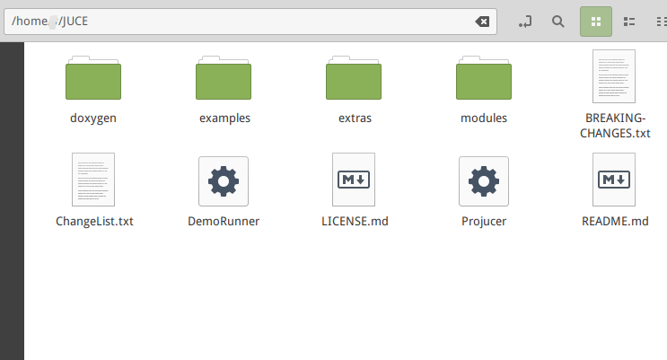
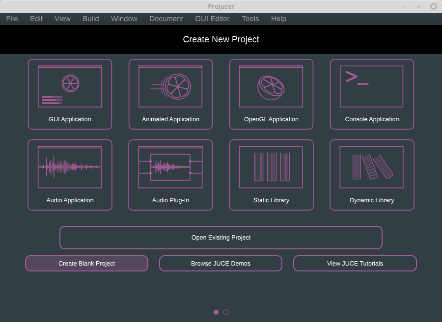
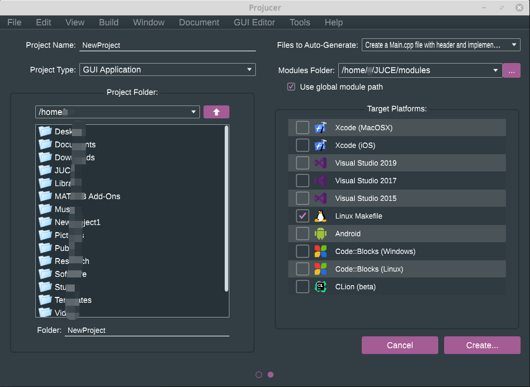

# JUCE类库的配置

Jules' Utility Class Extensions（JUCE）是基于 **c++** 的跨平台应用程序框架类库（Windows，Linux，Mac）。
优势是提供强大的音频、图像处理功能，拥有封装干净、快捷的API，适合跨平台的复杂C++应用程序开发。

> 更多的好处可以自行百度

## 接下来简述JUCE版“hello world”——下载及配置

还是推荐看[官网的教程](https://docs.juce.com/master/tutorial_new_projucer_project.html)，已经写的比较通俗易懂了。

从[官网](https://juce.com/)进入，根据自己计算机平台操作系统下载[免费版](https://shop.juce.com/get-juce/download)，下载的文件直接以压缩包的形式存储到本地。

**仅供参考↓↓↓**

### 1. Linux

> 本机环境：Linux-Mint 19.2 Cinnamon，Cmake 3.10.2，make 4.1，GCC 7.4.0，IDE JetBrains-Clion

下载到本地并解压，官网建议将解压后的“JUCE”文件夹放在“home folder”。


Linux下编译JUCE库所需要的依赖：g++，libfreetype6-dev，libx11-dev，libxinerama-dev，libxrandr-dev，libxcursor-dev，mesa-common-dev，libasound2-dev，freeglut3-dev，libxcomposite-dev，webkit2gtk-4.0-dev，libcurl4，libcurl4-openssl-dev

```shell
sudo apt install g++ libfreetype6-dev libx11-dev libxinerama-dev libxrandr-dev libxcursor-dev mesa-common-dev libasound2-dev freeglut3-dev libxcomposite-dev webkit2gtk-4.0-dev  libcurl4 libcurl4-openssl-dev
```

进入JUCE文件夹

打开程序Projucer，进入JUCE项目配置向导


可以先选择“GUI Application”来熟悉流程。

进入项目配置详情

- Project Name：自定义项目名称
- Project Type：自定义项目类型模板
- Project Folder：新建项目的路径
- Files to Auto-Generate：新建项目自动生成代码文件
- Modules Folder：新建项目引用JUCE模块的路径
- Target Platforms：选择编译的平台，根据本机环境，选择 *“Linux Makefile”* 和 *“CLion”*
- Create：点就完事了

创建完之后可以在之前选择的项目路径看见相应的文件夹，进入 `/Builds/LinuxMakefile` ，可以直接在当前路径下运行 `make` 命令，编译代码生成应用程序。

或者通过Clion打开本项目，构建并运行即可。本项目cmakelist文件在 `/Builds/CLion`