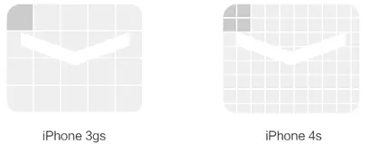
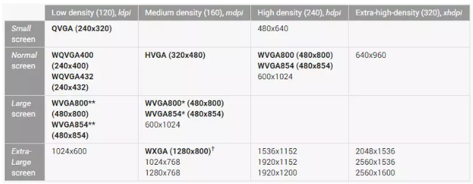

# Android开发下UI对不同类型屏幕适配问题

1. 概念
    
- 分辨率：手机屏幕的像素点数，一般描述成屏幕的“宽×高”。
  
  比如 $720 \times 1280$ 表示此屏幕在宽度方向有 720 个像素点，在高度方向有1280个像素点。每个点发出不同颜色的光，构成我们所看到的画面。

  

- 屏幕尺寸：屏幕物理尺寸，以英寸（inch）为单位，用屏幕对角线的实际长度表示。一般，$1 \  英寸 = 2.54 \  厘米$ （ $1 \   inch = 2.54 \  cm$ ）
- 像素密度（ DPI 与 PPI ）：PPI（pixels per inch）或 DPI（dots per inch）， 每英寸的长度上排列的像素点数量。

  > DPI 最初用于衡量打印物上每英寸的点数密度，就是表示你的打印机可以在一英寸内打印多少个点；
  > 
  > PPI 就是表示计算机屏幕上每英寸可以显示的像素点的数量。

  在电子设备的屏幕上，二者概念可以看做一个意思。

2. 逻辑像素问题

    **最简单的自适应思路：**
    在 DPI 相同的情况下，若一个手机是另一个手机尺寸的 2 倍，则前者的 UI 尺寸直接在后者 UI 尺寸大小的基础上乘以 2 ，就得到显示效果相同的样子了。

    <font color=red>**但是但是** $\downarrow$ $\downarrow$ $\downarrow$ </font>

    两个相同尺寸的屏幕，如 IPhone 3GS 与 IPhone 4S，二者DPI不同导致明显的清晰度差异。例如两个手机同时呈现一张显示效果相同的图片，后者画质更加清晰。
    
    由于 IPhone 3GS 的分辨率为 $320 \times 480$ ，IPhone 4S 分辨率为 $640 \times 960$。同屏幕下后者 DPI 更高，IPhone 4S 把 $2 \times 2$ 个像素当成一个像素来使用。
    

    即这里有一个“倍率”的问题，假设想要显示相同效果的同一张图，则需要准备两张分辨率不同的图片，譬如一张 $1 \times 1$，一张 $2 \times 2$ 。它们的实际像素尺寸各不相同，但都遵循一定规律，就是——宽、高之间的倍率是相同的。

    一般，把实际像素尺寸除以倍率得到的结果，称之为逻辑像素尺寸。只要两个屏幕逻辑像素相同，它们的显示效果就是相同的。

3. 安卓手机的逻辑像素

    安卓手机比苹果坑的一点就是，各个厂商都玩花的，最基础的一点就屏幕分辨率、尺寸等等的不一样，结果在自适应的时候需要乘除的倍率各不相同。

    安卓在不同区间定义了不同的倍率，分辨率在小范围波动的情形下被认为倍率不变。
    
    图中120、160、240、320都代表的是不同 DPI。

4. 以 $320 \times 480$ 为基准进行换算

    显示在移动端上的效果，起决定意义的还是逻辑像素尺寸。例如基准画布是 $320 \times 480$ 的，那么基于此分辨率设计的 UI，可以通过倍率的换算，使得运行在其他分辨率的界面上，效果是一样的。

    安卓和苹果基本上都以 $320 \times 480$ 为基准，不同的是各自逻辑单位的单位不同，苹果定义为 $pt$，安卓定义为 $dp$ 。但实际上含义是相同的，都表示逻辑像素。可以认为 $1 \  pt = 1 \  dp$ 。

5. 以安卓为例 <font size="1">*（qml语言）*</font>
   
    (1) 几个用到的单位：
   - dip（dp）：Density Independent Pixels，设备无关像素（逻辑像素）
   - px：像素
   - dpi：像素密度
   - density：密度，即上文所述倍率

    (2) 基准画布为 $320 dp \times 480 dp$ 、160 *dpi* ，在画布上进行 UI 设计

    (3) 计算倍率 $density = \frac{dpi}{160(px/inch)}$ 

    (4) $1 dp = density \  px$，即 $1 \  逻辑像素 = density \  实际像素$

    (5) 这也是前面基准画布的尺寸单位是 $dp$ 的原因，逻辑像素是一个相对的概念，基于逻辑像素尺寸设计完成 UI 后，转化成实际物理像素尺寸的时候，可以直接乘以倍率

    *e.g.* 在逻辑画布上设计一个 $30 \times 20$ 的按钮，那么应用在实际的屏幕（$240 \  dpi$）上。（demo暂时还有bug）

```qml
import QtQuick 2.6
import QtQuick.Window 2.2
import QtQuick.Controls 1.4
import QtQuick.Layouts 1.3

ApplicationWindow {

    id: window;
    width: 320;
    height: 480;
    visible: true;

    property real pixelDensity: Screen.pixelDensity * 25.4 /160 //获取当前屏幕dp
    property real multiplierH: window.height/480 // 当前窗口与基准画布高度之比
    property real multiplierW: window.width/320 // 当前窗口与基准画布宽度之比
    
    // 换算为实际像素
    function dpH(numbers) {
        return Math.round(numbers*pixelDensity*multiplierH);
    }
    function dpW(numbers) {
        return Math.round(numbers*pixelDensity*multiplierW);
    }

    Rectangle{
        anchors.fill: parent
        Text{
            anchors.topMargin: dpH(240)
            anchors.leftMargin: dpW(160)
            anchors.left: parent.left
            anchors.top: parent.top
            width: dpW(80)
            height: dpH(120)
            text: "中国，是以华夏文明为源泉、中华文化为基础，并以汉族为主体民族的多民族国家，通用汉语、汉字，汉族与少数民族被统称为“中华民族”，又自称为炎黄子孙、龙的传人。"
            font.pointSize: 10
            wrapMode: Text.Wrap
        }
    }
}
```

